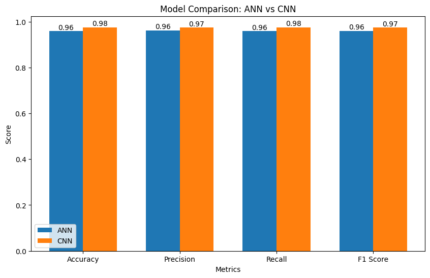
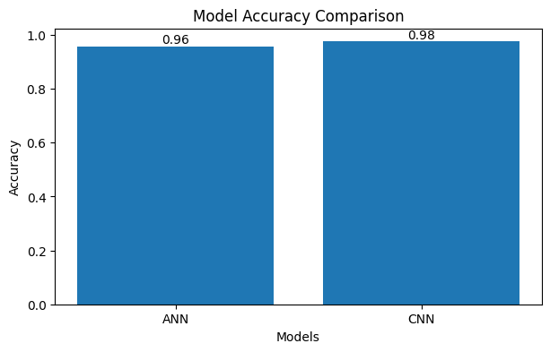

# ❤️ ECG Heartbeat Classification using Deep Learning  

---

## 🔍 Overview
This project focuses on classifying ECG (Electrocardiogram) heartbeat signals using Machine Learning and Deep Learning techniques. The goal is to accurately detect different heartbeat patterns and support early diagnosis of cardiovascular conditions.

---

## 🎯 Objectives
- Build and evaluate ML & DL models for ECG classification  
- Handle imbalanced datasets using advanced preprocessing  
- Compare ANN and CNN performance  
- Visualize model results for better interpretation  

---

## 📊 Dataset
- ECG heartbeat signal dataset  
- Multi-class classification  
- Imbalanced data distribution  
- Time-series signal-based features  

🔗 Dataset Link: https://www.kaggle.com/datasets/shayanfazeli/heartbeat  

---

## 🧠 Models Implemented
| Model | Description |
|------|------------|
| ANN  | Baseline neural network for classification |
| CNN  | Deep learning model for pattern recognition |

---

## ⚙️ Tech Stack
- **Programming:** Python  
- **Libraries:** NumPy, Pandas, Scikit-learn  
- **Deep Learning:** TensorFlow / Keras  
- **Visualization:** Matplotlib, Seaborn  

---

## 🔧 Key Features
✔ Data preprocessing & normalization  
✔ Class imbalance handling (SMOTE)  
✔ Model training & evaluation  
✔ Performance comparison  
✔ Visualization (Confusion Matrix, Accuracy Graphs)  

---

## 📈 Results

| Metric     | ANN   | CNN   |
|-----------|------|------|
| Accuracy  | 96%  | 98%  |
| Precision | 96%  | 97%  |
| Recall    | 96%  | 98%  |
| F1 Score  | 96%  | 97%  |

📊 The CNN model outperformed the ANN model across all evaluation metrics, demonstrating better capability in capturing patterns within ECG signals and delivering higher classification performance.

---

## 📷 Visualizations

### 🔹 Comparing Models

### 🔹 Accuracy Graph

---

## 🚀 Key Takeaways
- CNN is more effective for time-series ECG classification  
- Handling imbalance improves model performance  
- Deep learning enhances pattern recognition in medical data  

---

## 🔮 Future Improvements
- Implement LSTM / RNN for sequence modeling  
- Hyperparameter tuning  
- Deploy as a web-based application  
- Integrate real-time ECG data  

---
